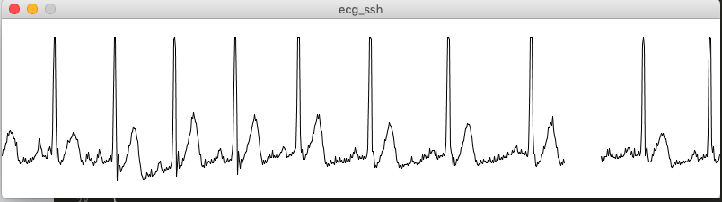

ECG plotter
========================================

ECG plotter shows ECG data via ssh connection. This plotter was written in processing language to achive real-time plotting which was difficult with python plotter (ex. using matplotlib).

Sample Screenshot
----------------------------------------

for movie check [this link](https://youtu.be/FeE_IXNSqtQ) to youtube

Requirements
----------------------------------------

### for Raspberry Pi

- python 3 (including these modules: luma.oled, Adafruit_ADS1x15, PIL)

### for client

- processing 3+

Installation
----------------------------------------

1. Download this repository to your computer.
1. Upload `ecg_remote.py` to raspberry pi.
1. Modify environment variables (`PI_ADDR`, `REMOTE_PYTHON_PATH`, `REMOTE_SCRIPT_PATH`) in `ecg_plotter.pbe` which is stored in your computer.

How to use
----------------------------------------

With processing app, run  `ecg_plotter.pde` file on your computer which can connect to your raspberry pi via ssh.

Author
----------------------------------------

[akchan (Satoshi Funayama) - GitHub](https://github.com/akchan)

[Satoshi Funayama(@akcharine) | Twitter](https://twitter.com/akcharine)